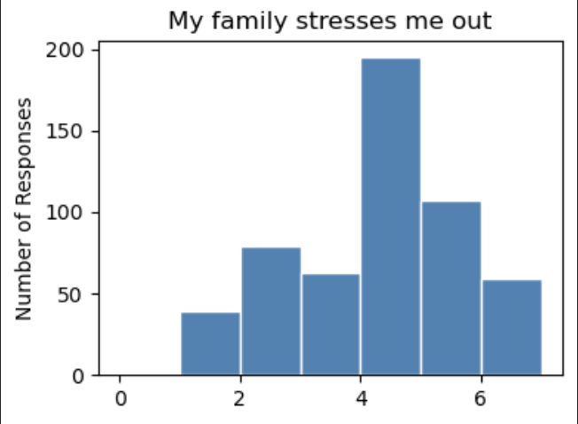
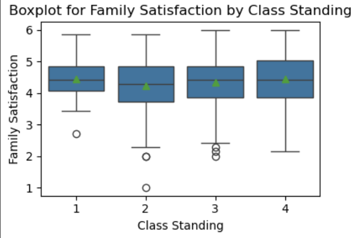
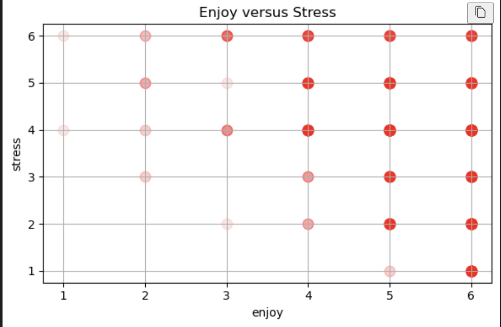

# VCQ Data Analysis Project

## Overview
This project analyzes the Voluntary Classroom Questionnaire (VCQ) dataset using Python. The notebook demonstrates data preparation, filtering, visualization, descriptive statistics, pivot tables, and statistical testing to explore patterns in student survey data.

The goal of this project was to practice working with a real multi-variable dataset and apply data analysis techniques to identify trends, compare groups, and interpret results.

## Dataset
The Voluntary Classroom Questionnaire (VCQ) dataset was developed as an educational resource for students learning statistical analysis. It includes demographic variables and survey measures related to areas such as family, well-being, school, work, and behavior.

The data was collected from 2015 to 2019 from students in Introduction to Statistics for the Social Sciences (SOC 201) and Quantitative Research Methods (SOC 360), with approximately 543 participants over the collection period.

Because the dataset was created for classroom learning and not publication, some demographic responses may have been skipped or fabricated to preserve anonymity.

## Objectives
- Prepare and clean survey data for analysis
- Explore patterns in student responses using visualizations
- Summarize variables with descriptive statistics
- Compare groups using pivot tables and aggregation
- Apply one-way and two-way ANOVA to test for differences across categories

## Analysis Included
- Data preparation and cleaning
- Filtering and conditioning variables
- Exploratory data analysis (EDA)
- Histograms, boxplots, scatterplots, and bar charts
- Descriptive statistics
- Pivot tables and grouped summaries
- One-way ANOVA
- Two-way ANOVA

## Technologies Used
- **Python**
- **Pandas** for data cleaning and manipulation
- **Matplotlib** and **Seaborn** for visualization
- **Statsmodels** for ANOVA and statistical modeling

## Skills Demonstrated
* Data cleaning and preprocessing
* Exploratory data analysis
* Statistical analysis
* Data visualization
* Interpretation of survey data
* Organizing a full analysis workflow in a notebook

## Notes
This project was completed for educational purposes using the VCQ dataset as a practice resource for statistical analysis.

## Author
Samantha Sandoval
Computer Science @ California State University San Marcos

## Histogram Example

## Boxplot Example

## Scatterplot Example

